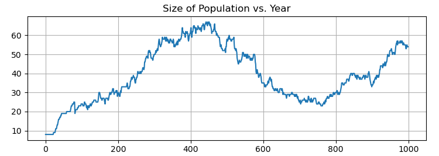
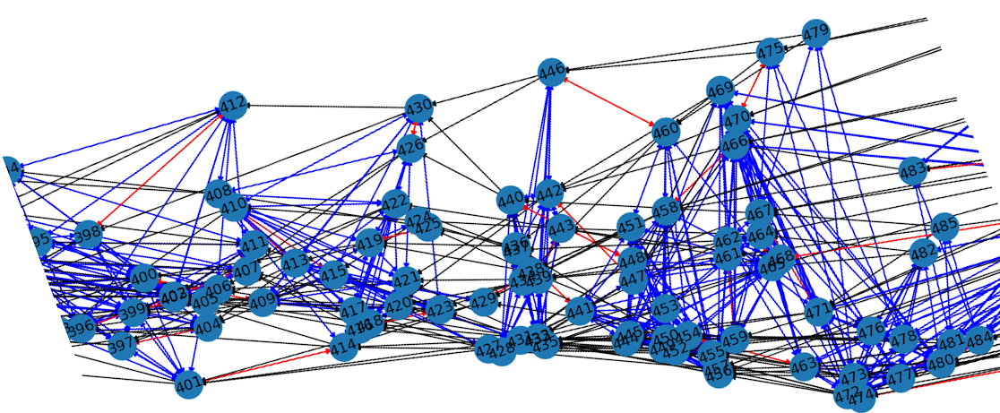

# family_tree
A moderately simple piece of code to model a trivially simplified family tree.  

This was created for the purpose of testing some of the neural inductive logic programming solvers from our research group.  In such analysis, it is important to be able to inject "noise" on the relational graph, and to examine the effect of average sample size to learning quality statistics.  Note: The cousin relationship is not currently implemented correctly, as can be seen in the samples below.

The parameters are chosen so that any population will evenutally die out, and then a long-lived population is chosen by monte-carlo sampling.
The graph of population vs. time for the random seed used in the example is show below:



Example JSON samples from this population:

```json

{"name": 424, "gender": "female", "birth_year": 863, "death_year": 944, "spouse": 422, "father": 415, "mother": 410, "grandfather": 404, "grandmother": 397, "children": [437, 443], "cousins": [419, 425]}

{"name": 425, "gender": "male", "birth_year": 864, "death_year": 945, "spouse": 419, "father": 413, "mother": 408, "grandfather": 404, "grandmother": 397, "children": [436, 438], "cousins": [424]}

```
And a section out of the full graph. The edge color key is as follows:
Red = spouse, Black = parent, Blue = cousin.



The family tree for some of the main Harry Potter characters, as reported by ChatGPT.

